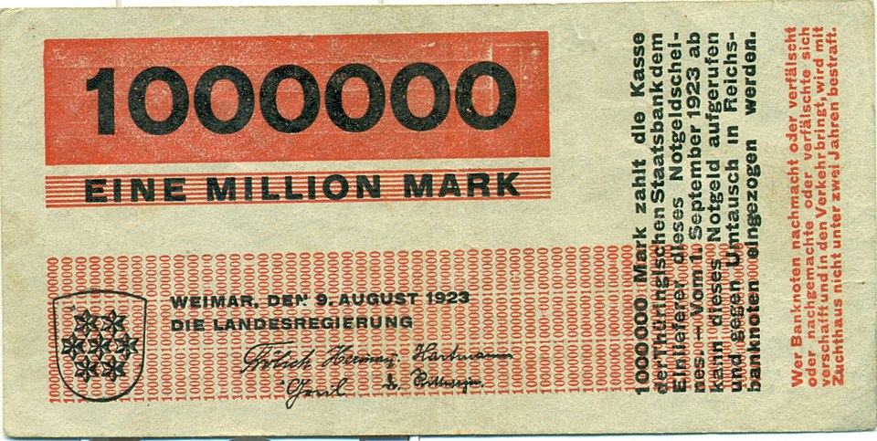

# Welcome to the Notgeld Project!

 

This repository contains the collection of "**Notgeld**" from Germany in 20th century. Notgeld is a form of emergency currency that was issued in Germany during times of economic crisis, particularly during the hyperinflation period of the early 1920s. The term "Notgeld" translates to "emergency money" in English. This money could be issued by local governments, municipalities, or private entities and was often used to supplement the official currency when it was in short supply or had lost its value. Notgeld notes were typically printed on paper and featured various designs, including local landmarks, historical figures, and artistic motifs. They were often used for everyday transactions, such as paying for goods and services, and could be exchanged for goods at local businesses. The use of Notgeld declined as the economy stabilized and the official currency regained its value.

Our aim in this repository is to scrape the available and surviving Notgeld from several sources, and create a database of these notes. Then, merging this information with academic research, we will create maps, regressions and other visualizations to understand the impact of Notgeld on the economy and society of Germany during this period.

